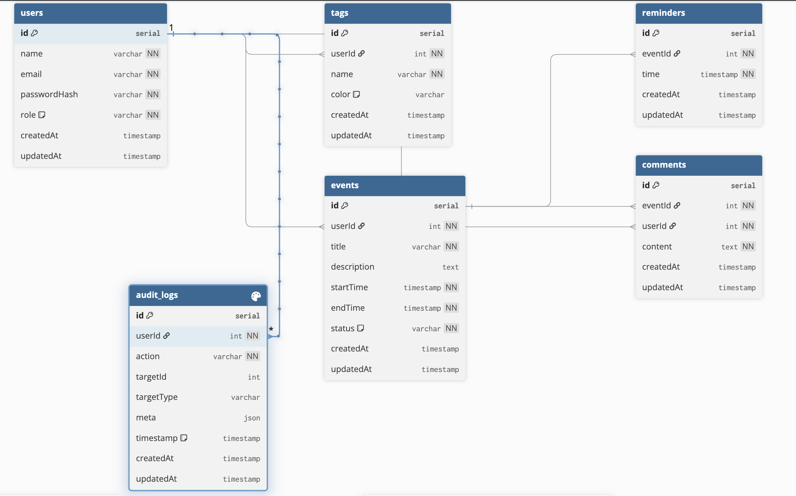
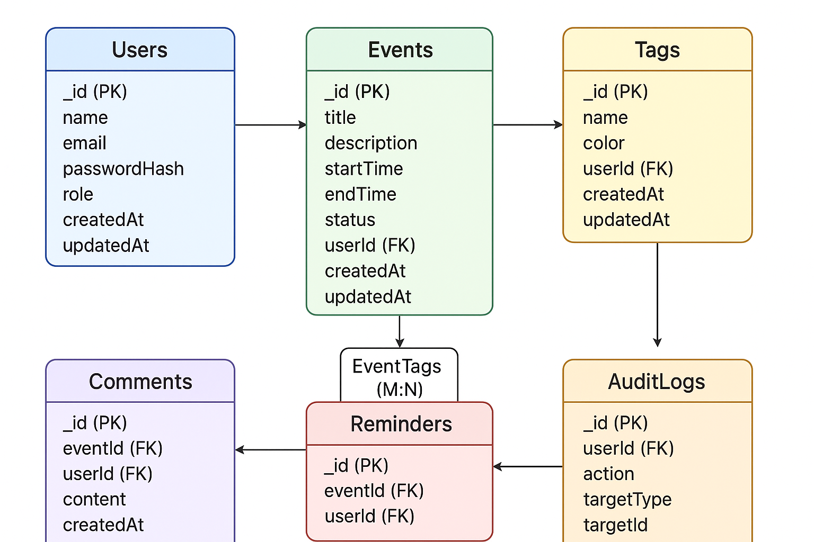
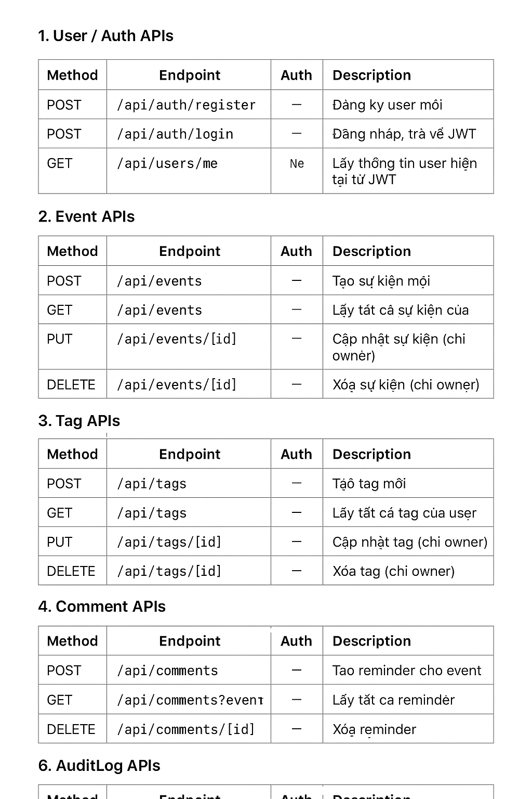

# Personal Schedule App

Ứng dụng quản lý lịch cá nhân với các tính năng:

- Tạo, sửa, xóa sự kiện (Event)
- Gán tags cho sự kiện (Tag)
- Quản lý tags với màu sắc tùy chỉnh
- Comment cho sự kiện
- Reminder cho các sự kiện quan trọng
- AuditLog (Admin)
- Giao diện trực quan, responsive, thân thiện người dùng
- Đăng nhập
- Đăng kí
- Đăng xuất

---

## Screenshots

### Tag Manager


### Event Modal


### Reminder List


### Database



### Database / ERD



## Database / API



---

## Installation

Clone project và cài dependencies:

```bash
git clone <repo-url>
cd <project-folder>
npm install
# hoặc
yarn install
```
